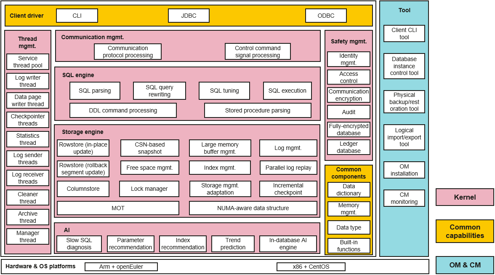

English | [简体中文](./README.md) 

-[What Is openGauss?](#what-is-opengauss)
- [Installation](#installation)
    - [Creating a Configuration File](#creating-a-configuration-file)
    - [Initializing the Installation Environment](#initializing-the-installation-environment)
    - [Installing openGauss](#installing-opengauss)
    - [Uninstalling openGauss](#uninstalling-opengauss)
        - [**Uninstallation**](#uninstallation)
        - [**One-Click Environment Cleanup**](#one-click-environment-cleanup)
- [Compilation](#compilation)
    - [Overview](#overview)
    - [OS and Software Dependencies](#os-and-software-dependencies)
    - [Downloading openGauss](#downloading-opengauss)
    - [Compiling Third-Party Software](#compiling-third-party-software)
    - [Building Code](#building-code)
        - [Using build.sh to Compile Code](#using-buildsh-to-compile-code)
        - [Using Commands to Compile Code](#using-commands-to-compile-code)
    - [Compiling an Installation Package](#compiling-an-installation-package)
- [Quick Start](#quick-start)
- [Documents](#documents)
- [Community](#community)
    - [Governance](#governance)
    - [Communication](#communication)
- [Contribution](#contribution)
- [Release Notes](#release-notes)
- [License](#license)

## What Is openGauss?

openGauss is an open source relational database management system (RDBMS) that features multi-core high performance, full-link security, and intelligent O&M.
Leveraging Huawei's extensive experience in database kernel development, openGauss has undergone significant adaptation and optimization across its architecture, transactions, storage engine, optimizer, and Arm-based optimizations. As an open source database, openGauss aims to build a diverse and vibrant open source database community in collaboration with developers worldwide.



**High performance**

openGauss breaks the bottlenecks associated with multi-core CPUs, achieving 1.5 million transactions per minute C (tpmC) on 2-socket 128-core Kunpeng servers and 3.5 million tpmC with the memory-optimized table (MOT) engine.

**Data partitioning**

To minimize lock contention, key data structures shared by internal threads are partitioned, which reduces conflicts during locked access. For example, CLOG utilizes partitioning optimization to address the ClogControlLock contention bottleneck.

**NUMA-aware kernel data structures**

Key data structures are NUMA-aware allocated to minimize cross-CPU access. For example, the global PGPROC array is divided according to the number of NUMA nodes, with memory requested on their respective NUMA nodes. This approach resolves the ProcArrayLock contention bottleneck.

**CPU pinning optimization**

To prevent performance instability caused by threads migrating between CPU cores, network interrupt binding is separated from background business thread binding.

**ARM instruction optimization**

ARM instruction optimization is achieved by utilizing LSE (Large System Extensions) atomic operations on the ARM platform, enabling efficient atomic operations for critical mutex variables.

**SQL bypass**

SQL execution flow is optimized, and CPU overhead is reduced through SQL bypass.

**High reliability**

Under normal service loads, the Recovery Time Objective (RTO) is less than 10 seconds, which reduces service unavailability caused by node failures.

**Parallel recovery**

Logs are flushed to drives and dispatched to a redo recovery thread upon transfer from the active to the standby node. This thread then distributes the logs to multiple parallel recovery threads based on the log type and data pages operated on. This process ensures the standby node's redo speed matches the primary node's log generation rate. In this way, the standby node remains in a real-time ready state, enabling instant failover.

**MOT engine (beta release)**

The MOT storage engine is designed for multi-core, large-memory systems, offering high online transaction processing (OLTP) performance and resource utilization. MOT data and indexes are stored in memory. Low-latency data access and efficient transaction execution are provided through NUMA-aware execution, algorithms that eliminate latch contention, and Just-In-Time (JIT) compilation for queries. For more information, see [MOT](https://docs.opengauss.org/en/docs/2.0.0/docs/Developerguide/mot.html).

**Security**

openGauss provides comprehensive database security capabilities, including account management, account authentication, password complexity check, account lockout, permissions management and verification, encrypted transmission, and operation auditing. These features ensure that service operations meet security requirements.

**Easy O&M**

openGauss integrates AI algorithms to reduce the database maintenance workload.

- **SQL execution prediction**

openGauss supports SQL execution prediction through the encoding of collected historical performance data and subsequent deep learning-based training and prediction.

- **SQL diagnostics**

openGauss includes a SQL statement diagnostic tool that identifies slow queries in advance.

- **Automatic parameter tuning**

openGauss automatically adjusts database parameters using machine learning methods, which increases tuning efficiency and reduces the cost associated with correct parameter configuration.

## Installation

### Creating a Configuration File

Before installing openGauss, create the **clusterconfig.xml** configuration file. The XML file contains information about the server where openGauss will be deployed, including the installation path, IP address, and port. The file guides the deployment of openGauss. Configure the XML file according to the actual situation.

The following describes how to create an XML configuration file based on the deployment scheme of one primary node and one standby node.
The values of the following parameters are for reference only. You can change them as required. Each line of information has a comment.

```
<?xml version="1.0" encoding="UTF-8"?>
<ROOT>
    <!-- Overall information about openGauss -->
    <CLUSTER>
    <!-- Database name -->
        <PARAM name="clusterName" value="dbCluster" />
    <!-- Database node name (host name) -->
        <PARAM name="nodeNames" value="node1,node2" />
    <!-- Node IP addresses corresponding to node names respectively -->
        <PARAM name="backIp1s" value="192.168.0.11,192.168.0.12"/>
    <!-- Database installation directory -->
        <PARAM name="gaussdbAppPath" value="/opt/huawei/install/app" />
    <!-- Log directory -->
        <PARAM name="gaussdbLogPath" value="/var/log/omm" />
    <!-- Temporary file directory -->
        <PARAM name="tmpMppdbPath" value="/opt/huawei/tmp"/>
    <!-- Database tool directory -->
        <PARAM name="gaussdbToolPath" value="/opt/huawei/install/om" />
    <!--Directory of the core file of the database -->
        <PARAM name="corePath" value="/opt/huawei/corefile"/>
    <!-- openGauss type. The following example uses a single-node system as an example. **single-inst** indicates that one primary and multiple active nodes are deployed in a single-node system. -->
        <PARAM name="clusterType" value="single-inst"/>
    </CLUSTER>
    <!-- Node deployment information on each server -->
    <DEVICELIST>
        <!-- Information about node deployment on **node1** -->
        <DEVICE sn="1000001">
        <!-- Host name of **node1** -->
            <PARAM name="name" value="node1"/>
        <!-- AZ where **node1** is located and AZ priority -->
            <PARAM name="azName" value="AZ1"/>
            <PARAM name="azPriority" value="1"/>
        <!-- If only one NIC is available for the server, set <b>backIP1/<b> and <b>sshIP1</b> to the same IP address. -->
            <PARAM name="backIp1" value="192.168.0.11"/>
            <PARAM name="sshIp1" value="192.168.0.11"/>
            
	    <!--dbnode-->
	    	<PARAM name="dataNum" value="1"/>
	    <!-- Database node port number -->
	    	<PARAM name="dataPortBase" value="26000"/>
	    <!-- Data directories on the primary and standby database nodes -->
	    	<PARAM name="dataNode1" value="/opt/huawei/install/data/db1,node2,/opt/huawei/install/data/db1"/>
	    <!-- Number of database nodes where the synchronization mode is set -->
	    	<PARAM name="dataNode1_syncNum" value="0"/>
        </DEVICE>

        <!-- Node deployment information on **node2**. The value of name is the host name. -->
        <DEVICE sn="1000002">
            <PARAM name="name" value="node2"/>
            <PARAM name="azName" value="AZ1"/>
            <PARAM name="azPriority" value="1"/>
            <!-- If only one NIC is available for the server, set <b>backIP1/<b> and <b>sshIP1</b> to the same IP address. -->
            <PARAM name="backIp1" value="192.168.0.12"/>
            <PARAM name="sshIp1" value="192.168.0.12"/>
	</DEVICE>
    </DEVICELIST>
</ROOT>
```

### Initializing the Installation Environment

After the openGauss configuration file is created, run the **gs_preinstall** command to prepare the account and environment so that you can perform openGauss installation and management operations with least privilege, ensuring system security.

**gs_preinstall** automatically prepares the installation environment as follows:

- Automatically sets Linux kernel parameters to improve the server loads. These parameters directly affect the running status of the database system. Adjust them only when necessary.
- Automatically copies the openGauss configuration file and installation package to the same directory on the openGauss host.
- Automatically creates the openGauss installation user and user group if they do not exist.
- Reads the directory information in the openGauss configuration file, create the directory, and grants the directory permissions to the installation user.

**Precautions**

- You must check the upper-layer directory permissions to ensure that the installation user has the read, write, and execute permissions on the installation package and configuration file directory.
- The mapping between each host name and IP address in the XML configuration file must be correct.
- Only the **root** user is authorized to run the **gs_preinstall** command.

**Procedure**

1. Log in to any host where openGauss is to be installed as user **root** and create a directory for storing the installation package as planned.

    ```shell
    mkdir -p /opt/software/openGauss
    chmod 755 -R /opt/software
    ```

   > **Note** 
   >
   > - Do not create the directory in the home directory of any openGauss user or its subdirectories because you may lack permissions for such directories.
   > - An openGauss user must have the read and write permissions on the **/opt/software/openGauss** directory.

2. Upload the installation package **openGauss-***x.x.x***-openEULER-64bit.tar.gz** and configuration file **clusterconfig.xml** to the directory created in the previous step.

3. Decompress the installation package in the directory where the installation package is stored. After the installation package is decompressed, the **script** directory is automatically generated in the **/opt/software/openGauss** directory. OM tool scripts such as **gs_preinstall** are generated in the **script** directory.

    ```shell
    cd /opt/software/openGauss
    tar -zxvf openGauss-x.x.x-openEULER-64bit.tar.gz
    ```

4. Go to the **script** directory.

    ```shell
    cd /opt/software/openGauss/script
    ```

5. If the openEuler OS is used, run the following command to open the **performance.sh** file, comment out **sysctl -w vm.min_free_kbytes=112640 &> /dev/null**, press **Esc** to switch to the command mode, and run the **:wq** command to save the modification and exit.

    ```shell
    vi /etc/profile.d/performance.sh
    ```

6. Before preinstallation, load the **lib** library in the installation package to ensure that the OpenSSL version is correct. In the following command, *{packagePath}* indicates the path to the installation package. In this example, the path is **/opt/software/openGauss**.

    ```shell
    export LD_LIBRARY_PATH={packagePath}/script/gspylib/clib:$LD_LIBRARY_PATH
    ```

7. Check whether the host name is the same as that in **/etc/hostname**. During preinstallation, the host name is checked.

8. Run **gs_preinstall** to configure the installation environment. If the environment is shared, add **--sep-env-file=*ENVFILE*** to separate environment variables to prevent mutual impact with other users. *ENVFILE* indicates the path to the environment variable separation file.
   Run the following command to execute **gs_preinstall** in interactive mode. During the execution, the trust between users **root** and between openGauss users is automatically created.

    ```shell
    ./gs_preinstall -U omm -G dbgrp -X /opt/software/openGauss/clusterconfig.xml
    ```

   **omm** is the database administrator (that is, the OS user who runs openGauss), **dbgrp** is the group name of the OS user who runs openGauss, and **/opt/software/openGauss/clusterconfig.xml** is the path to the openGauss configuration file. You need to set up mutual trust as prompted and enter the password of the **root** or openGauss user.

### Installing openGauss

After the openGauss installation environment is prepared by executing the pre-installation script, deploy openGauss based on the installation process.

**Prerequisites**

- You have successfully executed the **gs_preinstall** command.
- All the server OSs and networks are functioning properly.
- The **locale** parameter for each server is set to the same value.

**Procedure**

1. (Optional) Check whether the installation package and openGauss configuration file exist in the planned path. If they do not exist, perform the preinstallation again. Ensure that the preinstallation is successful and then perform the following steps.

2. Log in to the openGauss host and switch to the **omm** user.

    ```shell
    su - omm
    ```

   > **Note** 
   >
   > - **omm** is the user specified by the **-U** option in the **gs_preinstall** command.
   > - Run the **gs_install** command as user **omm**. Otherwise, an execution error is reported.

3. Run the **gs_install** command to install openGauss. If the cluster is installed in environment variable separation mode, run the **source** command to obtain the environment variable separation file *ENVFILE*.

    ```shell
    gs_install -X /opt/software/openGauss/clusterconfig.xml
    ```

    **/opt/software/openGauss/script/clusterconfig.xml** is the path to the openGauss configuration file. During the execution, you need to enter a database password as prompted. The password must meet complexity requirements. To ensure that you can use the database properly, remember the entered database password.

    A password must meet the following requirements:

    - Must contain at least eight characters.	
    - Cannot be the same as the user name, current password (ALTER), or the current password in reverse order.
    - Must contain at least three types of the following: uppercase letters (A to Z), lowercase letters (a to z), digits (0 to 9), and special characters ~!@#$%^&*()-_=+\|[{}];:,<.>/?

4. After the installation is successful, manually delete the trust between users **root** on the host, that is, delete the mutual trust file on each openGauss database node.

    ```shell
    rm -rf ~/.ssh
    ```

### Uninstalling openGauss

Uninstalling openGauss includes uninstalling openGauss and clearing the openGauss server environment.

#### **Uninstallation**

openGauss provides an uninstallation script to help you uninstall openGauss.

**Procedure**

1. Log in as the OS user **omm** to the primary database node.

2. Run the **gs_uninstall** command to uninstall openGauss.

    ```shell
    gs_uninstall --delete-data
    ```

    Alternatively, uninstall openGauss on each node.

    ```shell
    gs_uninstall --delete-data -L
    ```

#### **One-Click Environment Cleanup**

After openGauss is uninstalled, run the **gs_postuninstall** command to delete configurations from all openGauss servers if you do not need to re-deploy openGauss using these configurations. These configurations are made by the **gs_preinstall** script.
**Prerequisites**

- openGauss has been uninstalled.
- User **root** is trustworthy and available.
- Only user **root** is authorized to run the **gs_postuninstall** command.

**Procedure**

1. Log in to the openGauss server as user **root**.

2. Run the **ssh** *Host name* command to check whether mutual trust is established. Enter **exit** to exit.

   ```
   plat1:~ # ssh plat2 
   Last login: Tue Jan  5 10:28:18 2016 from plat1 
   plat2:~ # exit 
   logout 
   Connection to plat2 closed. 
   plat1:~ #
   ```

3. Go to the **script** directory.

   ```
   cd /opt/software/openGauss/script
   ```

4. Run **gs_postuninstall** to clear the environment configurations. If the cluster is installed in environment variable separation mode, run the **source** command to obtain the environment variable separation file *ENVFILE*.

    ```
    ./gs_postuninstall -U omm -X /opt/software/openGauss/clusterconfig.xml --delete-user --delete-group
    ```

    Alternatively, locally run **gs_postuninstall** on each openGauss node.

    ```
    ./gs_postuninstall -U omm -X /opt/software/openGauss/clusterconfig.xml --delete-user --delete-group -L
    ```

    **omm** is the name of the OS user who runs openGauss, and **/opt/software/openGauss/clusterconfig.xml** is the path to the openGauss configuration file. 

5. Delete the trust between users **root** from each openGauss database node.

## Compilation

### Overview

openGauss compilation requires two components: openGauss-server and binarylibs.

- openGauss-server: main code of openGauss. You can obtain it from the open source community.

- binarylibs: third-party open source software on which openGauss depends. You can compile the code in openGauss-third_party to obtain the software or download the compiled software from the open source community.

For details about how to compile the database, third-party library, and GCC, see [related blogs](https://opengauss.org/en/blogs/?post/xingchen/opengauss_compile/).

Before compiling openGauss, check the OS and software dependencies.

openGauss can be compiled using **build.sh** or commands. **build.sh** can generate an installation package.

### OS and Software Dependencies

openGauss supports the following OSs:

- CentOS 7.6 (x86)

- openEuler 20.03 LTS (AArch64)

- openEuler 20.03 LTS (x86_64)

- openEuler 22.03 LTS (AArch64)

- openEuler 22.03 LTS (x86_64)

- openEuler 24.03 LTS (AArch64)

- openEuler 24.03 LTS (x86_64)

For details about how to adapt to other OSs, see [related blogs](https://opengauss.org/en/blogs/?post/xingchen/opengauss_compile/).

The following table lists the software required for compiling openGauss.

You are advised to use the default installation packages of the following dependencies obtained from the OS installation CD/DVD-ROM or repositories. If any of the following software does not exist, obtain the recommended software version.

The software dependencies are as follows.

| Software            | Recommended Version            |
| ------------- | --------------- |
| libaio-devel  | 0.3.109-13      |
| flex          | 2.5.31 or later     |
| bison         | 2.7-4           |
| ncurses-devel | 5.9-13.20130511 |
| glibc-devel   | 2.17-111        |
| patch         | 2.7.1-10        |
| lsb_release   | 4.1             |
| readline-devel| 7.0-13          |
| jemalloc-devel| 3.6-5.0         |
| libcgroup-devel| 0.41-3.1         |
| libcurl-devel| 7.29-8.4         |
| libedit-devel| 3.0-3.1        |
| libxml2-devel| 2.9.1-2.11.5       |
| lz4-devel| 1.8.3-1.9.4      |
| numactl-devel| 2.0.12-2.0.16      |
| unixODBC-devel| 2.3.1-2.3.9      |
| zstd,zstd-devel| 1.55      |
| java-1.8.0-openjdk-devel| 1.8     |
| openssl-devel| 1.1.1m     |

```shell
yum install libaio-devel flex bison ncurses-devel glibc-devel patch readline-devel jemalloc-devel libcgroup-devel libcurl-devel libedit-devel libxml2-devel lz4-devel numactl-devel unixODBC-devel zstd zstd-devel java-1.8.0-openjdk-devel openssl-devel
### lsb_release installed in CentOS
yum install redhat-lsb-core
### lsb_release installed in openEuler
yum install dkms
```

### Downloading openGauss

Download openGauss-server and openGauss-third_party from the open source community.

https://opengauss.org/en/

You can obtain the compiled binarylibs from the following URLs. Decompress the downloaded file and rename it **binarylibs**.

The following table lists the compiled binaries of third-party libraries.

<table>
    <tr>
    	<td>Branch</td>
        <td>Tag</td>
        <td>GCC Version</td>
        <td>URL</td>
    </tr>
    <tr>
    	<td rowspan=2>1.0.0</td>
        <td>v1.0.0</td>
        <td rowspan=2>GCC 7.3</td>
        <td rowspan=2><a href="https://opengauss.obs.cn-south-1.myhuaweicloud.com/1.0.0/openGauss-third_party_binarylibs.tar.gz">https://opengauss.obs.cn-south-1.myhuaweicloud.com/1.0.0/openGauss-third_party_binarylibs.tar.gz</a></td>
        <tr><td>v1.0.1</td></tr> 
    </tr>
    <tr>
    	<td rowspan=1>1.1.0</td>
        <td>v1.1.0</td>
        <td>GCC 7.3</td>
        <td rowspan=1><a href="https://opengauss.obs.cn-south-1.myhuaweicloud.com/1.1.0/openGauss-third_party_binarylibs.tar.gz">https://opengauss.obs.cn-south-1.myhuaweicloud.com/1.1.0/openGauss-third_party_binarylibs.tar.gz</a></td>
    </tr>
    <tr>
    	<td rowspan=6>2.0.0</td>
        <td>v2.0.0</td>
        <td rowspan=6>GCC 7.3</td>
        <td rowspan=6><a href="https://opengauss.obs.cn-south-1.myhuaweicloud.com/2.0.0/openGauss-third_party_binarylibs.tar.gz">https://opengauss.obs.cn-south-1.myhuaweicloud.com/2.0.0/openGauss-third_party_binarylibs.tar.gz</a></td>
        <tr><td>v2.0.1</td></tr>
        <tr><td>v2.0.2</td></tr>
        <tr><td>v2.0.3</td></tr>
        <tr><td>v2.0.4</td></tr>
        <tr><td>v2.0.5</td></tr>
    </tr>
    <tr>
        <td rowspan=1>2.1.0</td>
        <td>v2.1.0</td>
        <td>GCC 7.3</td>
        <td rowspan=1><a href="https://opengauss.obs.cn-south-1.myhuaweicloud.com/2.1.0/openGauss-third_party_binarylibs.tar.gz">https://opengauss.obs.cn-south-1.myhuaweicloud.com/2.1.0/openGauss-third_party_binarylibs.tar.gz</a></td>
    </tr>
    <tr>
        <td rowspan=4>3.0.0</td>
        <td>v3.0.0</td>
        <td rowspan=4>GCC 7.3</td>
        <td rowspan=3><a href="https://opengauss.obs.cn-south-1.myhuaweicloud.com/3.0.0/openGauss-third_party_binarylibs.tar.gz">https://opengauss.obs.cn-south-1.myhuaweicloud.com/3.0.0/openGauss-third_party_binarylibs.tar.gz</a></td>
        <tr><td>v3.0.1</td></tr>
        <tr><td>v3.0.2</td></tr>
        <tr><td>v3.0.3</td>
        <td rowspan=1>
            <strong>openEuler for Arm:</strong> <a href="https://opengauss.obs.cn-south-1.myhuaweicloud.com/3.0.0/binarylibs/openGauss-third_party_binarylibs_openEuler_arm-3.0.3.tar.gz">https://opengauss.obs.cn-south-1.myhuaweicloud.com/3.0.0/binarylibs/openGauss-third_party_binarylibs_openEuler_arm-3.0.3.tar.gz</a> <br>
            <strong>openEuler for x86:</strong> <a href="https://opengauss.obs.cn-south-1.myhuaweicloud.com/3.0.0/binarylibs/openGauss-third_party_binarylibs_openEuler_x86_64-3.0.3.tar.gz">https://opengauss.obs.cn-south-1.myhuaweicloud.com/3.0.0/binarylibs/openGauss-third_party_binarylibs_openEuler_x86_64-3.0.3.tar.gz</a><br>
            <strong>CentOS for x86:</strong> <a href="https://opengauss.obs.cn-south-1.myhuaweicloud.com/3.0.0/binarylibs/openGauss-third_party_binarylibs_Centos7.6_x86_64-3.0.3.tar.gz">https://opengauss.obs.cn-south-1.myhuaweicloud.com/3.0.0/binarylibs/openGauss-third_party_binarylibs_Centos7.6_x86_64-3.0.3.tar.gz</a></td></tr>
        </tr>
    <tr>
        <td rowspan=2>3.1.0</td>
        <td>v3.1.0</td>
        <td rowspan=2>GCC 7.3</td>
        <td rowspan=2>
           <strong>openEuler for Arm:</strong> <a href="https://opengauss.obs.cn-south-1.myhuaweicloud.com/3.1.0/binarylibs/openGauss-third_party_binarylibs_openEuler_arm.tar.gz">https://opengauss.obs.cn-south-1.myhuaweicloud.com/3.1.0/binarylibs/openGauss-third_party_binarylibs_openEuler_arm.tar.gz</a><br>
            <strong>openEuler for x86:</strong> <a href="https://opengauss.obs.cn-south-1.myhuaweicloud.com/3.1.0/binarylibs/openGauss-third_party_binarylibs_openEuler_x86_64.tar.gz">https://opengauss.obs.cn-south-1.myhuaweicloud.com/3.1.0/binarylibs/openGauss-third_party_binarylibs_openEuler_x86_64.tar.gz</a><br>
            <strong>CentOS for x86:</strong> <a href="https://opengauss.obs.cn-south-1.myhuaweicloud.com/3.1.0/binarylibs/openGauss-third_party_binarylibs_Centos7.6_x86_64.tar.gz">https://opengauss.obs.cn-south-1.myhuaweicloud.com/3.1.0/binarylibs/openGauss-third_party_binarylibs_Centos7.6_x86_64.tar.gz</a>
        </tr>
    </tr>
    <tr><td>v3.1.1</td></tr>
    <tr>
        <td rowspan=1>5.0.0</td>
        <td>v5.0.0</td>
        <td>GCC 7.3</td>
        <td rowspan=1>
            <strong>openEuler 20.03 for Arm:</strong> <a href="https://opengauss.obs.cn-south-1.myhuaweicloud.com/5.0.0/binarylibs/openGauss-third_party_binarylibs_openEuler_arm.tar.gz">https://opengauss.obs.cn-south-1.myhuaweicloud.com/5.0.0/binarylibs/openGauss-third_party_binarylibs_openEuler_arm.tar.gz</a><br>
            <strong>openEuler 20.03 for x86:</strong> <a href="https://opengauss.obs.cn-south-1.myhuaweicloud.com/5.0.0/binarylibs/openGauss-third_party_binarylibs_openEuler_x86_64.tar.gz">https://opengauss.obs.cn-south-1.myhuaweicloud.com/5.0.0/binarylibs/openGauss-third_party_binarylibs_openEuler_x86_64.tar.gz</a><br>
            <strong>CentOS for x86:</strong> <a href="https://opengauss.obs.cn-south-1.myhuaweicloud.com/5.0.0/binarylibs/openGauss-third_party_binarylibs_Centos7.6_x86_64.tar.gz">https://opengauss.obs.cn-south-1.myhuaweicloud.com/5.0.0/binarylibs/openGauss-third_party_binarylibs_Centos7.6_x86_64.tar.gz</a><br>
            <strong>openEuler 22.03 for Arm:</strong> <a href="https://opengauss.obs.cn-south-1.myhuaweicloud.com/5.0.0/binarylibs_2203/openGauss-third_party_binarylibs_openEuler_2203_arm.tar.gz">https://opengauss.obs.cn-south-1.myhuaweicloud.com/5.0.0/binarylibs_2203/openGauss-third_party_binarylibs_openEuler_2203_arm.tar.gz</a><br>
            <strong>openEuler 22.03 for x86:</strong> <a href="https://opengauss.obs.cn-south-1.myhuaweicloud.com/5.0.0/binarylibs_2203/openGauss-third_party_binarylibs_openEuler_2203_x86_64.tar.gz">https://opengauss.obs.cn-south-1.myhuaweicloud.com/5.0.0/binarylibs_2203/openGauss-third_party_binarylibs_openEuler_2203_x86_64.tar.gz</a></td>
        </tr>
    </tr>
    <tr>
        <td rowspan=2>5.1.0</td>
        <td rowspan=2>v5.1.0</td>
        <td>GCC 7.3</td>
        <td rowspan=1>
            <strong>openEuler 20.03 for Arm:</strong> <a href="https://opengauss.obs.cn-south-1.myhuaweicloud.com/5.1.0/binarylibs/gcc7.3/openGauss-third_party_binarylibs_openEuler_arm.tar.gz">https://opengauss.obs.cn-south-1.myhuaweicloud.com/5.1.0/binarylibs/gcc7.3/openGauss-third_party_binarylibs_openEuler_arm.tar.gz</a><br>
            <strong>openEuler 20.03 for x86:</strong> <a href="https://opengauss.obs.cn-south-1.myhuaweicloud.com/5.1.0/binarylibs/gcc7.3/openGauss-third_party_binarylibs_openEuler_x86_64.tar.gz">https://opengauss.obs.cn-south-1.myhuaweicloud.com/5.1.0/binarylibs/gcc7.3/openGauss-third_party_binarylibs_openEuler_x86_64.tar.gz</a><br>
            <strong>CentOS for x86:</strong> <a href="https://opengauss.obs.cn-south-1.myhuaweicloud.com/5.1.0/binarylibs/gcc7.3/openGauss-third_party_binarylibs_Centos7.6_x86_64.tar.gz">https://opengauss.obs.cn-south-1.myhuaweicloud.com/5.1.0/binarylibs/gcc7.3/openGauss-third_party_binarylibs_Centos7.6_x86_64.tar.gz</a><br>
            <strong>openEuler 22.03 for Arm:</strong> <a href="https://opengauss.obs.cn-south-1.myhuaweicloud.com/5.1.0/binarylibs/gcc7.3/openGauss-third_party_binarylibs_openEuler_2203_arm.tar.gz">https://opengauss.obs.cn-south-1.myhuaweicloud.com/5.1.0/binarylibs/gcc7.3/openGauss-third_party_binarylibs_openEuler_2203_arm.tar.gz</a><br>
            <strong>openEuler 22.03 for x86:</strong> <a href="https://opengauss.obs.cn-south-1.myhuaweicloud.com/5.1.0/binarylibs/gcc7.3/openGauss-third_party_binarylibs_openEuler_2203_x86_64.tar.gz">https://opengauss.obs.cn-south-1.myhuaweicloud.com/5.1.0/binarylibs/gcc7.3/openGauss-third_party_binarylibs_openEuler_2203_x86_64.tar.gz</a></td>
        </tr>
        <td>GCC 10.3</td>
        <td rowspan=1>
            <strong>openEuler 20.03 for Arm:</strong> <a href="https://opengauss.obs.cn-south-1.myhuaweicloud.com/5.1.0/binarylibs/gcc10.3/openGauss-third_party_binarylibs_openEuler_arm.tar.gz">https://opengauss.obs.cn-south-1.myhuaweicloud.com/5.1.0/binarylibs/gcc10.3/openGauss-third_party_binarylibs_openEuler_arm.tar.gz</a><br>
            <strong>openEuler 20.03 for x86:</strong> <a href="https://opengauss.obs.cn-south-1.myhuaweicloud.com/5.1.0/binarylibs/gcc10.3/openGauss-third_party_binarylibs_openEuler_x86_64.tar.gz">https://opengauss.obs.cn-south-1.myhuaweicloud.com/5.1.0/binarylibs/gcc10.3/openGauss-third_party_binarylibs_openEuler_x86_64.tar.gz</a><br>
            <strong>CentOS for x86:</strong> <a href="https://opengauss.obs.cn-south-1.myhuaweicloud.com/5.1.0/binarylibs/gcc10.3/openGauss-third_party_binarylibs_Centos7.6_x86_64.tar.gz">https://opengauss.obs.cn-south-1.myhuaweicloud.com/5.1.0/binarylibs/gcc10.3/openGauss-third_party_binarylibs_Centos7.6_x86_64.tar.gz</a><br>
            <strong>openEuler 22.03 for Arm:</strong> <a href="https://opengauss.obs.cn-south-1.myhuaweicloud.com/5.1.0/binarylibs/gcc10.3/openGauss-third_party_binarylibs_openEuler_2203_arm.tar.gz">https://opengauss.obs.cn-south-1.myhuaweicloud.com/5.1.0/binarylibs/gcc10.3/openGauss-third_party_binarylibs_openEuler_2203_arm.tar.gz</a><br>
            <strong>openEuler 22.03 for x86:</strong> <a href="https://opengauss.obs.cn-south-1.myhuaweicloud.com/5.1.0/binarylibs/gcc10.3/openGauss-third_party_binarylibs_openEuler_2203_x86_64.tar.gz">https://opengauss.obs.cn-south-1.myhuaweicloud.com/5.1.0/binarylibs/gcc10.3/openGauss-third_party_binarylibs_openEuler_2203_x86_64.tar.gz</a></td>
        </tr>
    </tr>
    <tr>
        <td rowspan=1>6.0.0</td>
        <td rowspan=1></td>
        <td>GCC 10.3</td>
        <td rowspan=1>
           <strong>openEuler for Arm:</strong> <a href="https://opengauss.obs.cn-south-1.myhuaweicloud.com/6.0.0/binarylibs/gcc10.3/openGauss-third_party_binarylibs_openEuler_arm.tar.gz">https://opengauss.obs.cn-south-1.myhuaweicloud.com/6.0.0/binarylibs/gcc10.3/openGauss-third_party_binarylibs_openEuler_arm.tar.gz</a><br>
            <strong>openEuler for x86:</strong> <a href="https://opengauss.obs.cn-south-1.myhuaweicloud.com/6.0.0/binarylibs/gcc10.3/openGauss-third_party_binarylibs_openEuler_x86_64.tar.gz">https://opengauss.obs.cn-south-1.myhuaweicloud.com/6.0.0/binarylibs/gcc10.3/openGauss-third_party_binarylibs_openEuler_x86_64.tar.gz</a><br>
            <strong>CentOS for x86:</strong> <a href="https://opengauss.obs.cn-south-1.myhuaweicloud.com/6.0.0/binarylibs/gcc10.3/openGauss-third_party_binarylibs_Centos7.6_x86_64.tar.gz">https://opengauss.obs.cn-south-1.myhuaweicloud.com/6.0.0/binarylibs/gcc10.3/openGauss-third_party_binarylibs_Centos7.6_x86_64.tar.gz</a><br>
            <strong>openEuler 22.03 for Arm:</strong> <a href="https://opengauss.obs.cn-south-1.myhuaweicloud.com/6.0.0/binarylibs/gcc10.3/openGauss-third_party_binarylibs_openEuler_2203_arm.tar.gz">https://opengauss.obs.cn-south-1.myhuaweicloud.com/6.0.0/binarylibs/gcc10.3/openGauss-third_party_binarylibs_openEuler_2203_arm.tar.gz</a><br>
            <strong>openEuler 22.03 for x86:</strong> <a href="https://opengauss.obs.cn-south-1.myhuaweicloud.com/6.0.0/binarylibs/gcc10.3/openGauss-third_party_binarylibs_openEuler_2203_x86_64.tar.gz">https://opengauss.obs.cn-south-1.myhuaweicloud.com/6.0.0/binarylibs/gcc10.3/openGauss-third_party_binarylibs_openEuler_2203_x86_64.tar.gz</a></td>
        </tr>
    </tr>
    <tr>
        <td rowspan=1>master</td>
        <td rowspan=1></td>
        <td>GCC 10.3</td>
        <td rowspan=1>
           <strong>openEuler for Arm:</strong> <a href="https://opengauss.obs.cn-south-1.myhuaweicloud.com/latest/binarylibs/gcc10.3/openGauss-third_party_binarylibs_openEuler_arm.tar.gz">https://opengauss.obs.cn-south-1.myhuaweicloud.com/latest/binarylibs/gcc10.3/openGauss-third_party_binarylibs_openEuler_arm.tar.gz</a><br>
            <strong>openEuler for x86:</strong> <a href="https://opengauss.obs.cn-south-1.myhuaweicloud.com/latest/binarylibs/gcc10.3/openGauss-third_party_binarylibs_openEuler_x86_64.tar.gz">https://opengauss.obs.cn-south-1.myhuaweicloud.com/latest/binarylibs/gcc10.3/openGauss-third_party_binarylibs_openEuler_x86_64.tar.gz</a><br>
            <strong>CentOS for x86:</strong> <a href="https://opengauss.obs.cn-south-1.myhuaweicloud.com/latest/binarylibs/gcc10.3/openGauss-third_party_binarylibs_Centos7.6_x86_64.tar.gz">https://opengauss.obs.cn-south-1.myhuaweicloud.com/latest/binarylibs/gcc10.3/openGauss-third_party_binarylibs_Centos7.6_x86_64.tar.gz</a><br>
            <strong>openEuler 22.03 for Arm:</strong> <a href="https://opengauss.obs.cn-south-1.myhuaweicloud.com/latest/binarylibs/gcc10.3/openGauss-third_party_binarylibs_openEuler_2203_arm.tar.gz">https://opengauss.obs.cn-south-1.myhuaweicloud.com/latest/binarylibs/gcc10.3/openGauss-third_party_binarylibs_openEuler_2203_arm.tar.gz</a><br>
            <strong>openEuler 22.03 for x86:</strong> <a href="https://opengauss.obs.cn-south-1.myhuaweicloud.com/latest/binarylibs/gcc10.3/openGauss-third_party_binarylibs_openEuler_2203_x86_64.tar.gz">https://opengauss.obs.cn-south-1.myhuaweicloud.com/latest/binarylibs/gcc10.3/openGauss-third_party_binarylibs_openEuler_2203_x86_64.tar.gz</a><br>
            <strong>openEuler 24.03 for Arm:</strong> <a href="https://opengauss.obs.cn-south-1.myhuaweicloud.com/latest/binarylibs/gcc10.3/openGauss-third_party_binarylibs_openEuler_2403_arm.tar.gz">https://opengauss.obs.cn-south-1.myhuaweicloud.com/latest/binarylibs/gcc10.3/openGauss-third_party_binarylibs_openEuler_2403_arm.tar.gz</a><br>
            <strong>openEuler 24.03 for x86:</strong> <a href="https://opengauss.obs.cn-south-1.myhuaweicloud.com/latest/binarylibs/gcc10.3/openGauss-third_party_binarylibs_openEuler_2403_x86_64.tar.gz">https://opengauss.obs.cn-south-1.myhuaweicloud.com/latest/binarylibs/gcc10.3/openGauss-third_party_binarylibs_openEuler_2403_x86_64.tar.gz</a></td>
        </tr>
    </tr>
</table>

Note: For 6.0.0 and later versions, use the third-party library containing GCC 10.3 for compilation.

Now the complete openGauss code is ready. Store the code in the following directories (**sda** as an example):

- /sda/openGauss-server
- /sda/binarylibs
- /sda/openGauss-third_party

### Compiling Third-Party Software

Before compiling openGauss, compile the open source and third-party software on which openGauss depends. These open source and third-party software are stored in the openGauss-third_party code repository and need to be built only once. If the open source software is updated, you need to rebuild the software.

Alternatively, obtain the compiled open source software from the **binarylibs** library.

If you want to compile third-party software by yourself, visit the openGauss-third_party repository for details. 

The compiled files are saved in the **binarylibs** directory at the same level as **openGauss-third_party**. These files are required for compiling **openGauss-server**.

### Building Code

#### Using build.sh to Compile Code

**build.sh** in openGauss-server is an important script tool required for compilation. This tool integrates software compilation and packaging functions.

The following table describes the options.

| Option  | Default Value                       | Parameter                                   | Description                                              |
| :---- | :--------------------------- | :------------------------------------- | :------------------------------------------------ |
| -h    | Do not use this option.             | -                                      | Displays the help menu.                                        |
| -m    | release                      | [debug &#124; release &#124; memcheck] | Specifies the target version.                                    |
| -3rd  | ${Code directory}/binarylibs | [binarylibs path]                      | Specifies the binarylibs path, which must be an absolute path.       |
| --cmake  | -             | -                                      | Uses CMake for compilation.                      |
| -pkg  | Do not use this option.             | -                                      | Compresses the compiled code into an installation package.                      |
| -nopt | Do not use this option.             | -                                      | If this function is used, the CPUs related to the Kunpeng platform are not optimized. |

> **Notice** 
>
> - **-m [debug | release | memcheck]** indicates that three target versions can be selected:
>    - **release**: generates a release binary program. During the compilation, kernel debugging code is removed by configuring advanced GCC optimization options. This option is typically used in the production environment or performance test environment.
>    - **debug**: generates a debug binary program. Kernel debugging code is added during the compilation. This option is typically used in the developer self-test platform.
>    - **memcheck**: generates a memcheck binary program. During the compilation, the ASAN function is added based on the debug version to locate memory issues.
> - **-3rd [binarylibs path]** specifies the path to **binarylibs**. By default, **binarylibs** exists in the current code folder. This option does not need to be specified if **binarylibs** is moved to **openGauss-server** or a soft link to **binarylibs** is created in **openGauss-server**. However, the file can be easily deleted by the **git clean** command.
> - Each option in the script has a default value. The limited number of options and their simple dependencies ensure the script is easy to use. If the required parameter values differ from the defaults, configure them according to your specific needs.

Run the following command to compile openGauss-server:

```
[user@linux openGauss-server]$ sh build.sh -m [debug | release | memcheck] -3rd [binarylibs path]
```

Example: 

```
[user@linux openGauss-server]$ sh build.sh       # Compile and install openGauss of the release version. binarylibs or its soft link must exist in the code directory. Otherwise, the compilation will fail.
[user@linux openGauss-server]$ sh build.sh -m debug -3rd /sda/binarylibs    # Compile and install openGauss of the debug version.
[user@linux openGauss-server]$ sh build.sh -m debug -3rd /sda/binarylibs --cmake    # Use CMake to compile the code. If --cmake is not specified, Make is used by default.
```

Installation path of the compiled software: **/sda/openGauss-server/dest**

Path to the compiled binary file: **/sda/openGauss-server/dest/bin**

Compilation log: **make_compile.log**

#### Using Commands to Compile Code

You can compile code using Make or CMake.

**Compilation with Make:**

1. Obtain the binary files of open source third-party libraries.

   From the 3.1.0 branch and 3.0.3 tag, different binary files of open source third-party libraries are provided for different environments. Currently, the community provides binary files of third-party libraries for CentOS for x86_64, openEuler for AArch64, and openEuler for x86_64.
   You can [download openGauss](#download-openGauss) from the specific URL.

2. Set environment variables.

   ```
   export CODE_BASE=________     # Path to openGauss-server
   export BINARYLIBS=________    # Path to binarylibs
   export GAUSSHOME=$CODE_BASE/dest/
   export GCC_PATH=$BINARYLIBS/buildtools/________    # GCC version, which is the same as the GCC version in the third-party package. Generally, the GCC version can be GCC 7.3 or GCC 10.3.
   export CC=$GCC_PATH/gcc/bin/gcc
   export CXX=$GCC_PATH/gcc/bin/g++
   export LD_LIBRARY_PATH=$GAUSSHOME/lib:$GCC_PATH/gcc/lib64:$GCC_PATH/isl/lib:$GCC_PATH/mpc/lib/:$GCC_PATH/mpfr/lib/:$GCC_PATH/gmp/lib/:$LD_LIBRARY_PATH
   export PATH=$GAUSSHOME/bin:$GCC_PATH/gcc/bin:$PATH

   ```

3. Select a version for configuration.

   **debug** version:

   ```
   # GCC 10.3.1 (generally used for openEuler for Arm)
   ./configure --gcc-version=10.3.1 CC=g++ CFLAGS='-O0' --prefix=$GAUSSHOME --3rd=$BINARYLIBS --enable-debug --enable-cassert --enable-thread-safety --with-readline --without-zlib

   # GCC 10.3.0
   ./configure --gcc-version=10.3.0 CC=g++ CFLAGS='-O0' --prefix=$GAUSSHOME --3rd=$BINARYLIBS --enable-debug --enable-cassert --enable-thread-safety --with-readline --without-zlib

   ```

   **release** version:

   ```
   # GCC 10.3.1 (generally used for openEuler for Arm)
   ./configure --gcc-version=10.3.1 CC=g++ CFLAGS="-O2 -g3" --prefix=$GAUSSHOME --3rd=$BINARYLIBS --enable-thread-safety --with-readline --without-zlib

   # GCC 10.3.0
   ./configure --gcc-version=10.3.0 CC=g++ CFLAGS="-O2 -g3" --prefix=$GAUSSHOME --3rd=$BINARYLIBS --enable-thread-safety --with-readline --without-zlib

   ```

   **memcheck** version:

   ```
   # GCC 10.3.1 (generally used for openEuler for Arm)
   ./configure --gcc-version=10.3.1 CC=g++ CFLAGS='-O0' --prefix=$GAUSSHOME --3rd=$BINARYLIBS --enable-debug --enable-cassert --enable-thread-safety --with-readline --without-zlib --enable-memory-check

   # GCC 10.3.0
   ./configure --gcc-version=10.3.0 CC=g++ CFLAGS='-O0' --prefix=$GAUSSHOME --3rd=$BINARYLIBS --enable-debug --enable-cassert --enable-thread-safety --with-readline --without-zlib --enable-memory-check

   ```

   > **Notice** 
   >
   > - **[debug | release | memcheck]** indicates that three target versions are available.
   > - On the Arm platform, add **-D__USE_NUMA** to **CFLAGS**.
   > - On the Armv8.1 or later platform (for example, Kunpeng 920), add **-D__ARM_LSE** to **CFLAGS**.
   > - You do not need to specify the **--3rd** option if **binarylibs** is moved to **openGauss-server** or a soft link to **binarylibs** is created in **openGauss-server**. However, the file can be easily deleted by the **git clean** command.

4. Run the following commands to compile openGauss:

   ```
   [user@linux openGauss-server]$ make -sj
   [user@linux openGauss-server]$ make install -sj
   ```

If the following information is displayed, the compilation and installation are successful.

   ```
   openGauss installation complete.
   ```

- Installation path of the compiled software: **$GAUSSHOME**

- Path to the compiled binary file: **$GAUSSHOME/bin**

**Compilation with CMake:**

1. Obtain the binary files of open source third-party libraries.

2. Set environment variables.

   ```
    #### Specify the version and platform.
    export DEBUG_TYPE=release
    export BUILD_TUPLE=aarch64
    export GCC_VERSION=10.3.1
    ##### Importing environment variables of third-party libraries
    export THIRD_BIN_PATH=________ 
    export JAVA_HOME=$THIRD_BIN_PATH/kernel/platform/openjdk8/${BUILD_TUPLE}/jdk/
    export PATH=${JAVA_HOME}/bin:$PATH
    export APPEND_FLAGS="-g3 -w -fPIC"
    export GCCFOLDER=$THIRD_BIN_PATH/buildtools/gcc10.3
    export CC=$GCCFOLDER/gcc/bin/gcc
    export CXX=$GCCFOLDER/gcc/bin/g++
    export LD_LIBRARY_PATH=$GCCFOLDER/gcc/lib64:$GCCFOLDER/isl/lib:$GCCFOLDER/mpc/lib/:$GCCFOLDER/mpfr/lib/:$GCCFOLDER/gmp/lib/:$LD_LIBRARY_PATH
    export LD_LIBRARY_PATH=$THIRD_BIN_PATH/kernel/dependency/kerberos/comm/lib:$LD_LIBRARY_PATH
    export LD_LIBRARY_PATH=$THIRD_BIN_PATH/kernel/dependency/libcgroup/comm/lib:$LD_LIBRARY_PATH
    export LD_LIBRARY_PATH=$THIRD_BIN_PATH/kernel/dependency/openssl/comm/lib:$LD_LIBRARY_PATH
    export LD_LIBRARY_PATH=$THIRD_BIN_PATH/kernel/dependency/libcurl/comm/lib:$LD_LIBRARY_PATH
    export PATH=$GCCFOLDER/gcc/bin:$PATH
    export PREFIX_HOME=________
    export GAUSSHOME=$PREFIX_HOME
    export LD_LIBRARY_PATH=$GAUSSHOME/lib:$LD_LIBRARY_PATH
    export PATH=$GAUSSHOME/bin:$PATH

   ```
3. Select a version for configuration.

   ```
   # The version to be generated is specified by the **DEBUG_TYPE** environment variable in step 2.
   mkdir cmake_build && cd cmake_build
   cmake .. -DENABLE_MULTIPLE_NODES=OFF -DENABLE_THREAD_SAFETY=ON -DENABLE_READLINE=ON -DENABLE_MOT=ON
   # openEuler 22.03 or openEuler 24.03
   cmake .. -DENABLE_MULTIPLE_NODES=OFF -DENABLE_THREAD_SAFETY=ON -DENABLE_READLINE=ON -DENABLE_MOT=ON -DENABLE_OPENEULER_MAJOR=ON
   ```

    > **Notice**
    > 
    > - For openEuler 22.03 and openEuler 24.03, add **-DENABLE_OPENEULER_MAJOR=ON**.

4. Run the following commands to compile openGauss:

   ```
   [user@linux cmake_build]$ make -sj && make install -sj
   ```

The compilation is complete.

- Installation path of the compiled software: **$GAUSSHOME**

- Path to the compiled binary file: **$GAUSSHOME/bin**

### Compiling an Installation Package 

Read [Using build.sh to Compile Code](#using-\build.sh-to-compile-code) to learn how to use **build.sh** to compile openGauss.

Add the **-pkg** option to compile an installation package.

```
[user@linux openGauss-server]$ sh build.sh -m [debug | release | memcheck] -3rd [binarylibs path] -pkg
```

Example:

```
sh build.sh -pkg       # Create an openGauss installation package of the release version. binarylibs or its soft link must exist in the code directory. Otherwise, the compilation will fail.
sh build.sh -m debug -3rd /sdc/binarylibs -pkg           # Create an openGauss installation package of the debug version.
```

- Installation package directory: **./package**

- Compilation log: **make_compile.log**

- Installation package packaging log: **./package/make_package.log**

## Quick Start

For details, see [Quick Start Guide](https://docs.opengauss.org/en/docs/2.0.0/docs/Quickstart/Quickstart.html).

## Documents

For more installation guides, tutorials, and API references, see [Documentation](https://docs.opengauss.org/en/).

## Community

### Governance

Check how openGauss implements open [governance](https://gitee.com/opengauss/community/blob/master/governance.en.md).

### Communication

- Use WeLink for developer communication.
- IRC: `#opengauss-meeting` (for meeting minutes only)
- Mailing list: https://opengauss.org/en/online-communication/

## Contribution

openGauss welcomes contributions from everyone. For details, see [Contribution](https://opengauss.org/en/contribution/).

## Release Notes

See [Release Notes](https://docs.opengauss.org/en/docs/2.0.0/docs/Releasenotes/Releasenotes.html).

## License

[Mulan PSL v2](http://license.coscl.org.cn/MulanPSL2)
